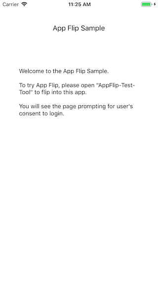

# App Flip Sample for iOS

This sample app demonstrates an App Flip compatible account linking integration
on iOS. You can use this app to verify how to respond to an incoming App Flip
universal link from Google mobile apps.

The sample app is preconfigured to integrate with the
[App Flip Test Tool for iOS](https://github.com/googlesamples/identity-appflip-tester-ios),
which you can use to easily get started before you configure account linking
with Google.

Documentation links:

- [App Flip Overview](https://developers.google.com/identity/account-linking/app-flip-overview)
- [App Flip for iOS](https://developers.google.com/identity/account-linking/app-flip-ios)

## Prerequisites

1. Xcode installed (version 10.0 or above)
1. iOS device (iOS 10.0 or above)
1. Familiarity with configuring
   [Universal links](https://developer.apple.com/documentation/uikit/inter-process_communication/allowing_apps_and_websites_to_link_to_your_content/enabling_universal_links)
   for iOS applications.

## Getting started

1. Open this project in Xcode
1. Enter a unique **Bundle Identifier** and set your **Provisioning Profile**
   in the Xcode project settings.
1. Create an `apple-app-site-association` file to whitelist your app identifier:

    ```
    {
      "applinks": {
        "apps": [],
        "details": [{
          "appID": "D3KQX62K1A.com.sample.app",
          "paths": ["*"]
        }]
      }
    }
    ```

   Use the following format for app identifiers: `<Team Identifier>.<Bundle Identifier>`

1. Host this file at `https://<your-website-domain>/.well-known/apple-app-site-association`
1. Add the following to your **Associated Domains** in Xcode project settings:
   `applinks:<your-website-domain>`
1. Build and run the app on your target device
1. Setup and run the [App Flip Test Tool for iOS](https://github.com/googlesamples/identity-appflip-tester-ios) to simulate the App Flip interaction

## Screenshots



## License

Copyright 2019 Google LLC

Licensed under the Apache License, Version 2.0 (the "License");
you may not use this file except in compliance with the License.
You may obtain a copy of the License at

    http://www.apache.org/licenses/LICENSE-2.0

Unless required by applicable law or agreed to in writing, software
distributed under the License is distributed on an "AS IS" BASIS,
WITHOUT WARRANTIES OR CONDITIONS OF ANY KIND, either express or implied.
See the License for the specific language governing permissions and
limitations under the License.
